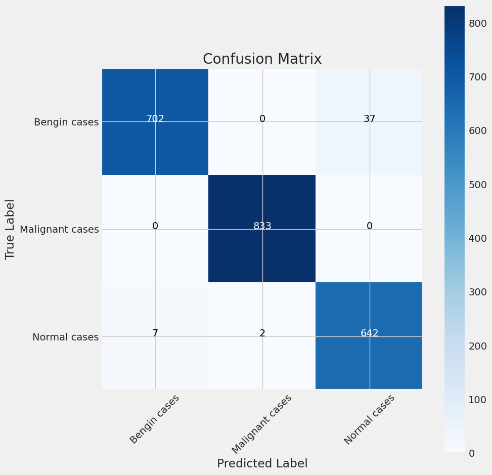

# Lung Cancer Classification Using Deep Learning

## Introduction

Lung cancer remains one of the most prevalent and deadly forms of cancer worldwide, posing a significant challenge to global healthcare. Early and accurate detection is crucial for successful treatment and improved patient outcomes. This repository presents a cutting-edge approach to lung cancer identification and classification leveraging the power of deep learning techniques, specifically transfer learning with the pre-trained VGG19 Convolutional Neural Network (CNN) architecture.

## Methodology

The methodology adopted in this project involves the following key steps:

1. **Dataset Collection and Preprocessing**: The project utilizes the "Lung Cancer Dataset" from Kaggle, comprising over 14,600 lung CT images categorized into "Normal," "Benign," and "Malignant" classes. Advanced data augmentation techniques, such as rotation, flipping, and brightness adjustments, were employed to generate a diverse and balanced dataset, mitigating class imbalance and improving model generalization.

2. **Transfer Learning with VGG19**: The renowned VGG19 model, lauded for its exceptional image recognition capabilities, forms the backbone of the CNN architecture. The top classification layers were removed, and a custom classification head was meticulously designed, comprising dense layers, batch normalization, and dropout layers. This unique combination optimizes the network's ability to identify complex patterns embedded in lung CT scans, effectively enhancing the accuracy of sample classification.

3. **Model Training and Evaluation**: The model was trained using stochastic gradient descent optimization, categorical cross-entropy loss, and class weights to address class imbalance. A comprehensive evaluation framework, incorporating various performance metrics such as accuracy, precision, recall, and F1-score, was employed to assess the model's performance on the test dataset, ensuring a holistic understanding of its strengths and limitations.

## Results

The developed model demonstrated outstanding performance, achieving:

- **Training Accuracy**:  99.68%
- **Validation Accuracy**: 98.11%
- **Test Accuracy**: 97.93%

The model exhibited high precision, recall, and F1-scores across all classes, showcasing its ability to accurately classify lung nodules as benign, malignant, or normal. The confusion matrix further highlighted the model's exceptional classification capabilities, with minimal misclassifications across classes.

## Applications

The accurate classification of pulmonary nodules enabled by this project has far-reaching implications in the field of healthcare:

1. **Early Detection and Intervention**: By accurately identifying suspicious lung nodules, the model can assist radiologists in making informed decisions, leading to rapid intervention and improved patient outcomes in lung cancer treatment.

2. **Screening Prioritization**: In resource-constrained healthcare systems, the precise classification of lung nodules can help identify high-risk cases, enabling healthcare facilities to prioritize follow-up screening for those most in need, optimizing resource allocation.

3. **Surgeon Decision Support**: Surgeons can integrate the model's predictions into their decision-making process, tailoring their surgical approach based on the tumor's malignancy, leading to more precise procedures and minimizing the extent of surgery when possible.

## Conclusion

This project demonstrates the immense potential of deep learning and transfer learning techniques in revolutionizing lung cancer diagnosis. By leveraging the VGG19 architecture and employing advanced data augmentation strategies, the developed model achieved remarkable accuracy in classifying lung nodules. The successful implementation paves the way for further refinement and integration into clinical workflows, ultimately contributing to earlier lung cancer detection and improved patient outcomes.

## Future Work

Potential future directions for this project include:

- Exploring multi-model ensemble techniques to further improve classification performance.
- Deploying the model as an API for seamless integration into medical software systems.
- Creating an interactive web interface for improved accessibility and usability.
- Conducting clinical trials and validating the model's performance on external datasets.
- Investigating the interpretability of the model's predictions using techniques like Grad-CAM to provide valuable insights for medical professionals.

## Getting Started

To get started with this project, follow these steps:

1. Clone the repository: `git clone https://github.com/your-username/repo-name.git`
2. Install the required dependencies: `pip install -r requirements.txt`
3. Download the lung cancer dataset from Kaggle and place it in the `data/raw/` directory.
4. Run the Jupyter Notebooks in the `notebooks/` directory to preprocess the data, train the model, and evaluate its performance.

## Contributing

Contributions to this project are welcome! If you find any issues or have suggestions for improvements, please open an issue or submit a pull request. Ensure that your contributions adhere to the project's coding standards and include appropriate documentation.

## Acknowledgments

This project was made possible with the support of our supervisor, Mrs. Deepika R., and the resources provided by BV Raju Institute of Technology. We extend our gratitude to the Artificial Intelligence & Data Science department for their continuous encouragement and guidance.

## Developed By:

### Students:
- [Sangem Jaya Prakash](https://www.linkedin.com/in/sangemjayaprakash)
- [Jeshwanth Panuganti](https://www.linkedin.com/in/panuganti-jeshwanth-84aa1324b)
- [Rokati Poojitha](https://www.linkedin.com/in/poojitha-rokati-49aa1324b)

### Faculty Guides:
- Surajit Das
- Lavanya G
- Niladri Sekhar Dey

## License

This project is licensed under the [MIT License](LICENSE).